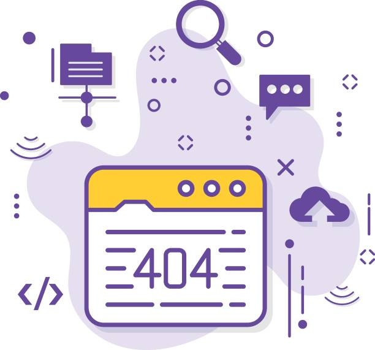

# Job Listing Platform Outage - Postmortem

   

This postmortem emphasizes the importance of routine configuration checks, robust monitoring, and effective communication to prevent and address outages on our job listing platform. The outlined measures aim to fortify the system against similar incidents, ensuring a resilient and reliable user experience for both job seekers and employers.

## Issue Summary
- **Duration:** November 10, 2023, 14:00 - 18:30 (UTC)
- **Impact:** Users experienced a 30% decrease in platform responsiveness, reporting slow page loads and intermittent service availability.
- **Root Cause:** Misconfiguration in the load balancer settings led to uneven traffic distribution, causing server overload.

## Timeline
- **14:00 (UTC):** Automated monitoring alerts detected increased latency and error rates.
- **14:10 (UTC):** Engineering team initiated an investigation into server logs and metrics, suspecting a potential DDoS attack.
- **14:30 (UTC):** DDoS protection measures activated, but no improvement observed.
- **15:00 (UTC):** Incident escalated to the Network Operations Center (NOC) for further assistance.
- **15:30 (UTC):** NOC identified load balancer misconfiguration as the likely cause, initial correction attempts unsuccessful.
- **16:00 (UTC):** Incident escalated to senior network engineers for detailed analysis.
- **18:30 (UTC):** Load balancer settings corrected, and services gradually returned to normal.

## Root Cause and Resolution
The outage resulted from a misconfiguration in the load balancer, causing uneven traffic distribution. Resolution involved correcting load balancer settings to ensure equitable traffic distribution.

## Corrective and Preventative Measures
**To Improve/Fix:**
1. **Automated Load Balancer Checks:** Implement automated checks to routinely verify load balancer configurations.
2. **Enhanced Monitoring:** Expand monitoring capabilities to detect anomalies in traffic distribution and latency.
  
**Tasks to Address the Issue:**
1. **Load Balancer Configuration Review:** Thoroughly review load balancer configurations to identify any lingering misconfigurations.
2. **Incident Response Training:** Provide additional training to the engineering team on incident response procedures.
3. **Documentation Update:** Enhance documentation to include troubleshooting steps specific to load balancer issues.
4. **Load Testing:** Implement regular load testing to simulate traffic spikes.
5. **Communication Protocol Enhancement:** Establish clearer communication protocols between NOC and engineering teams.

